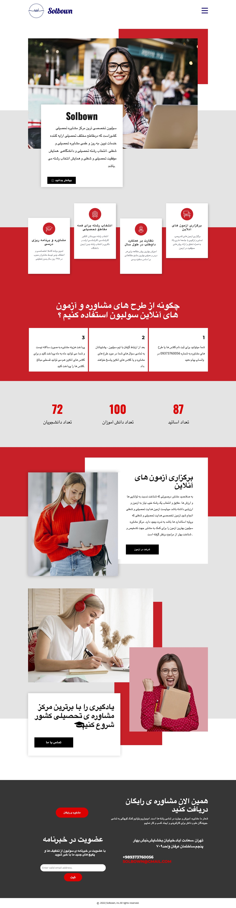
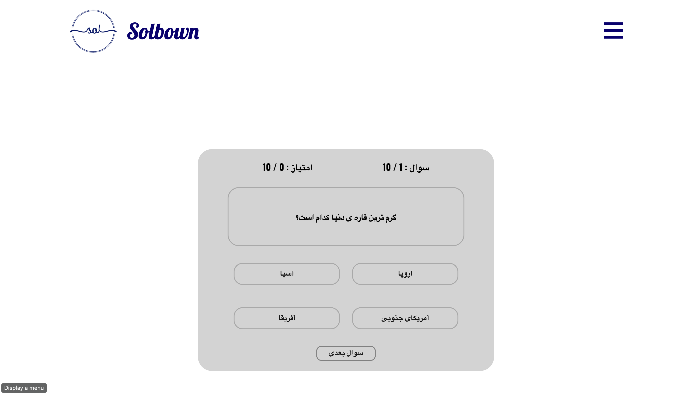

# Quiz Project

A web-based quiz interface built with HTML, CSS, JavaScript, and SASS.  
Designed to be clean, responsive, and easy to extend.

---

## 📸 Preview





---

## ⚙️ Features

- Clean UI with responsive design  
- Multiple pages/routes under `pages/` folder  
- Styled with SASS + CSS  
- No heavy frameworks; lightweight and simple  

---

## 🧰 Tech Stack

- HTML5  
- CSS3 / SASS  
- JavaScript  

---

## 🚀 How to Run / Build

```bash
# If you need to compile SASS
npm install
npm run sass-compile   # or similar script

# Otherwise just open index.html in your browser
